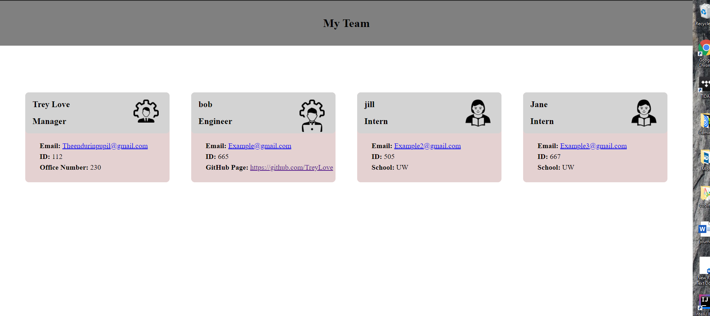

# TeamBuilderApp

## Description

This is a node js application that allows managers to create an html page that gives a variety of information for each member of their team. Some of this info includes their names, employee IDs, roles, emails, office numbers, schools and gitHub profiles. The current roles supported are Managers, Engineers and Interns.

## Instructions
1. Install the dependencies from the package.json file
2. Enter the index.js file with node
3. Answers the prompts you are presented with
4. When all the prompts are answered go the the generated profile folder and you will find your dynamically built team profile page.

aside 
To run tests on the classes install the developer dependecies and type in npm test into the terminal.

